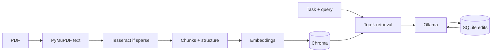

# Legal document intelligence

- **Author:** MD Mutasim Billah Noman
- **Updated on:** 20 April 2026

Local pipeline for **legal-style PDFs**: text extraction (OCR when sparse), **chunking**, **embedding** into Chroma, **semantic retrieval**, **grounded drafting** via **Ollama**, and **learning from operator edits** (few-shot prompt augmentation in SQLite).

Not legal advice. Outputs are drafts grounded on retrieved evidence.

---

## Architecture



1. **Ingest**: Per-page text; sparse pages get OCR. Text is cleaned, chunked with overlap, and enriched with regex/heuristic **structured** fields (dates, money, emails, headings).
2. **Index**: `sentence-transformers` embeddings → persistent Chroma.
3. **Draft**: Retrieval uses deduplication of identical chunk text. Empty index → clear message, no LLM call. The model sees numbered evidence and is asked for inline `[n]` citations; the API returns **full evidence** for inspection.
4. **Feedback**: Operator edits are diffed; **few-shot pairs** are stored and reused for the same **task** (similarity-ranked when history is large).

---

## Setup

```bash
python -m venv .venv
source .venv/bin/activate   # Windows: .venv\Scripts\activate
pip install -r requirements.txt
```

**System**: [Tesseract](https://github.com/tesseract-ocr/tesseract) (OCR); [Ollama](https://ollama.com) with a pulled chat model (default `llama3.2`).

```bash
export PYTHONPATH=.
mkdir -p data/chroma data/uploads logs
uvicorn src.api.main:app --host 127.0.0.1 --port 8000
```

Open `http://127.0.0.1:8000/` (redirects to `/ui/`) for the **Review workspace**—side-by-side system draft and operator edit, expandable evidence, and feedback results—or use `http://127.0.0.1:8000/docs` for the API.

### Sample PDF and CLI

```bash
python scripts/create_sample_pdf.py          # writes examples/sample_memo.pdf
python scripts/ingest.py examples/sample_memo.pdf
python scripts/demo.py                       # needs Ollama; draft → feedback → draft
```

### Configuration

Copy [`.env.example`](.env.example) to `.env`. Main variables use the `LEGAL_` prefix (see `src/config.py`). `HF_TOKEN` in `.env` is loaded for Hugging Face downloads.

| Variable | Default | Role |
|----------|---------|------|
| `LEGAL_DATA_DIR` | `data` | Data root |
| `LEGAL_CHROMA_PATH` | `data/chroma` | Chroma persistence |
| `LEGAL_FEEDBACK_DB_PATH` | `data/feedback.db` | SQLite |
| `LEGAL_OLLAMA_BASE_URL` | `http://127.0.0.1:11434` | LLM API |
| `LEGAL_OLLAMA_MODEL` | `llama3.2` | Model name |
| `LEGAL_EMBEDDING_MODEL` | `sentence-transformers/all-MiniLM-L6-v2` | Embeddings |
| `LEGAL_CHUNK_SIZE` / `LEGAL_CHUNK_OVERLAP` | `900` / `120` | Chunking |
| `LEGAL_RETRIEVE_TOP_K` | `8` | Chunks per draft |
| `LEGAL_OCR_MIN_CHARS_PER_PAGE` | `50` | OCR trigger |
| `LEGAL_FEEDBACK_FEW_SHOT_LIMIT` | `5` | Max few-shot examples |
| `LEGAL_LOG_FILE` | `logs/log.log` | App log file |

Logs go to `LEGAL_LOG_FILE` and stderr.

---

## API

| Method | Path | Purpose |
|--------|------|---------|
| GET | `/health` | Liveness |
| GET | `/health/ready` | Ollama reachable + model present |
| POST | `/ingest` | Multipart PDF upload → index |
| POST | `/draft` | `task`, optional `query`, optional `doc_id_filter` |
| POST | `/feedback` | `draft_id`, `edited_text` |

Task strings are defined in `src/generation/prompts.py` (`case_fact_summary`, `document_summary`, `title_review_summary`, `internal_memo`, `notice_summary`, `document_checklist`).

`POST /draft` returns **503** if Ollama is unreachable (with indexed chunks).

---

## Project layout

```
src/ingestion/    PDF → text → chunks + structured fields
src/retrieval/    Embeddings + Chroma
src/generation/   Prompts + Ollama + citation checks
src/feedback/     SQLite + learning from edits
src/api/          FastAPI app
static/           Optional operator UI (`/ui/`)
scripts/          Sample PDF, ingest CLI, demo, evaluate, smoke tests
examples/         Sample output snippet
tests/            pytest
```

---

## Docker

The API runs in Compose; **Ollama stays on the host** (or another machine) and the container talks to it via `host.docker.internal` by default (see [`docker-compose.yml`](docker-compose.yml)).

### Install Docker

If you see `command not found: docker`, install a Docker CLI and engine:

- **macOS / Windows:** [Docker Desktop](https://docs.docker.com/desktop/) (includes Docker Compose v2).
- **Linux:** [Docker Engine](https://docs.docker.com/engine/install/) and [Compose plugin](https://docs.docker.com/compose/install/linux/).

Start Docker Desktop (macOS/Windows) or ensure the Docker daemon is running (Linux). Then verify:

```bash
docker --version
docker compose version
```

### Environment

Copy [`.env.example`](.env.example) to `.env` if you have not already. For Compose, `LEGAL_OLLAMA_BASE_URL` defaults to `http://host.docker.internal:11434` so the container can reach Ollama on the host. Start Ollama on the host and pull your model (e.g. `ollama pull llama3.2`) before drafting.

### Common commands

| Command | Purpose |
|--------|---------|
| `docker compose up --build` | Build images and run the stack in the foreground (logs in the terminal). |
| `docker compose up -d --build` | Same, detached (background). |
| `docker compose down` | Stop and remove containers (named volumes like `hf_cache` are kept unless you add `-v`). |
| `docker compose logs -f` | Follow container logs (useful after `up -d`). |
| `docker compose ps` | Show service status. |
| `docker compose build --no-cache` | Force a clean image rebuild. |

Then open `http://127.0.0.1:8000/` or `http://127.0.0.1:8000/docs` as in [Setup](#setup).

---

## Tests and evaluation

```bash
pytest tests/
python scripts/evaluate.py    # no Ollama; needs examples/sample_memo.pdf
```

`scripts/smoke_api.sh` exercises the HTTP API (needs running API + Ollama + sample PDF).

---

## Assumptions and tradeoffs

- **Assumption**: Tesseract and Ollama are installed locally; embedding weights may download on first use (`HF_HOME` optional).
- **Tradeoff**: Character-level chunking and lightweight OCR—not full layout analysis.
- **Tradeoff**: Few-shot prompt augmentation from edits instead of model fine-tuning—demonstrates the improvement loop without training.
